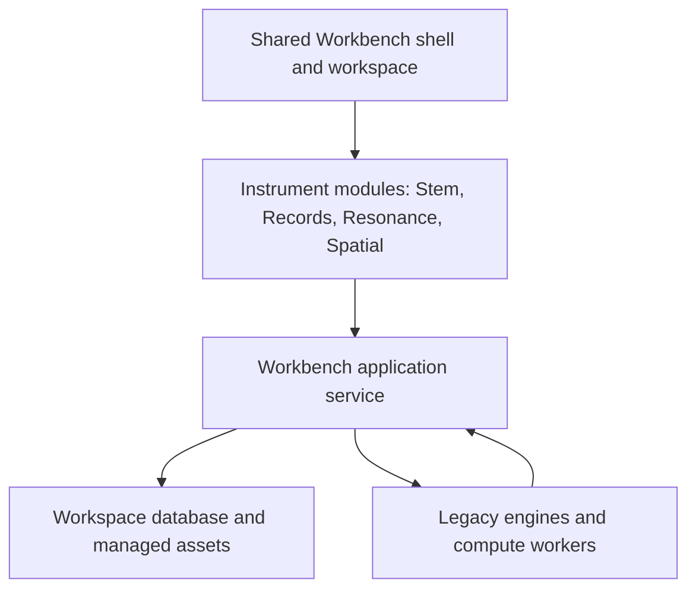

# Unified VOXIS Workbench — architecture proposal 0.1

Status: proposed implementation design for the user-endorsed unified direction.
This document changes no running instrument, database, or acceptance status.

## Decision and purpose

Build one local-first Workbench with a common language, interface, context,
application service, versioned record model, and managed storage. Instruments
become modules of that platform. Home's external launcher is a transitional
adapter, not the final user experience. Reuse proven internals while moving
shared responsibilities into the platform; avoid a simultaneous rewrite.

The user should select an experiment once, use several instruments, and retain
sources, notes, versions, provenance, and a clear account of what is saved.
A common visual style alone does not meet this requirement.

## Reconciled baseline

Evidence: merged Bridge/Browser source at `9c43da3`; Home PR #8 at `0e1ee376`;
operator reports in the development conversation; supplied Resonance server,
engine and database modules; delivered standalone Stem Lab 0.2 flip candidate.
The installed packages are not assumed identical to unrelated public prototypes.

| Area | Established boundary | Remaining work |
| --- | --- | --- |
| Bridge / Browser | Merged #6/#7; original-byte storage, hashes, summaries, exports and Search Session references | Stem v2 recognition; richer shared context; supported restore adapters |
| Home | Draft #8; operator reports all instruments launch; read-only Resonance compatibility probe added | Record remaining acceptance details; shared in-app workspace and module lifecycle |
| Stem Lab | Standalone HTML; operator reports horizontal flip works; v2 stores flip per configuration/take | Recognized v2 record summaries; shared storage and workspace module integration |
| Resonance | Node/Express; SQLite cycles, JSON registry notes, process memory; GET /api/model reads model | Identity/session contract; explicit write lifecycle; restore/isolation proofs |
| WXR | Native 3D matrices, reflection flag, local slots and export | Resolve missing per-image hashes; module adapter; Quest-specific acceptance |
| Grammar Kernel | Shared canonical event contract with epistemic boundaries | Integrate through existing contract, preserving human-validation gates |

Correction: Bridge can preserve unrecognized JSON as `unsupported` and export
its original bytes. Stem v2 currently lacks recognized structural validation and
summaries; it is not categorically impossible to archive its JSON. Unsupported
retention must never be presented as supported replay or interpreted geometry.

The existing README/ROADMAP and Home scope contain historical baseline language.
They do not establish current runtime acceptance. User-reported launch/flip
success does not close every recovery, persistence, or version-specific gate.

## Target topology

### Platform and ownership

Initial implementation choice: evolve the existing Python/SQLite record service
into the single owner of Workbench writes. Use browser JavaScript and reusable
UI components for the shared shell; preserve Canvas and WebXR where appropriate.
This reuses accepted storage behavior and the existing Home security boundary.
Do not make a new UI framework, desktop wrapper, or backend rewrite a prerequisite
for the first integration slice. Evaluate those choices with a small module-host
prototype before committing to a framework or packaging dependency.

Resonance's JavaScript simulation may remain a supervised Node worker behind a
versioned module API. That is an internal implementation boundary, not a separate
user-facing application or permission to write directly to shared tables. Legacy
Resonance retains its own stores until its adapter is proven on an isolated copy.
There must be no period where two services both claim authoritative ownership
of the same workspace data.

A single database per workspace is the target for structured records. Large
scans, audio, and video belong in managed asset storage with hashes, not repeated
inside every capture. Existing native JSON bytes remain immutable archive objects,
even when they contain embedded data. A database migration must not rewrite them.

Desktop shell and module UI share one origin where practical. Quest uses a
separate presentation surface with the same contracts; HTTPS, pairing, access
control, and actual device behavior require a separate proof. Do not expose the
local database or all interfaces simply to make a headset connect.

## Common language and record model

Preserve the seven existing foundation concepts: Folio, Representation,
Observation, Search Session, Alignment, Evidence, Hypothesis. Add explicit runtime
and storage concepts without silently renaming existing canonical events.

| Term | Meaning and identity |
| --- | --- |
| Workspace | Project container with its own database, managed assets and settings |
| Experiment | Question, protocol and research status; may group several Search Sessions |
| Search Session | Research activity with declared constraints or explicit exploratory status; not a browser tab |
| Runtime session | Running module instance and transient state; distinct from a saved research record |
| Folio | Manuscript page identity; independent of a particular scan |
| Representation | Specific source image/render/crop with hash, dimensions and processing provenance |
| Placement | Versioned transform of representations, constraints and annotations; not automatically a correspondence claim |
| Take | Immutable recorded operation/trajectory with its configuration and events |
| Capture / native record | Original module export preserved byte-for-byte with producer and schema identity |
| Checkpoint | State sufficient for a declared restoration scope; a screenshot or cycle-history row is not enough |
| Observation / measurement | Separate records of what was noticed and what was computed |
| Evidence / hypothesis | Explicit research roles with supporting references and review state; never inferred from import success |

Use durable application IDs for entities and revisions, SHA-256 for byte identity,
and namespaced producer IDs for native records. Distinguish a record ID, source
hash, native take ID, and runtime session ID in both code and UI.

Proposed logical entities: workspaces, experiments, search_sessions, sources,
representations, placements, landmarks, captures, takes, observations,
measurements, evidence, hypotheses, session_links, module_instances, checkpoints,
assets and migration_history. These are a design, not tables to add immediately.
Every workspace-owned relationship must be scoped to the same workspace.

Existing Bridge `session_links.search_session_ref` is a string reference, not an
existing canonical Search Session table. Preserve it as a legacy reference until
an explicit resolution step maps it to a canonical ID; never invent a session.

## Shared functions and interface

The shell owns navigation, active experiment/context, sources, records, notes,
status, recovery, and common controls. Modules own their specialized views and
algorithms. Shared services own record validation, storage, identity, revisions,
import/export, asset resolution and capability negotiation.

Use one component vocabulary and design-token set for typography, spacing,
colors, focus, buttons, alerts and forms. Start from Home/Stem's existing light
interface rather than redesigning every instrument independently. Maintain
keyboard access and tablet/desktop layouts; VR interaction remains device-specific.

Common actions have precise meanings:

| Action/state | Contract |
| --- | --- |
| Save draft | Persist editable working state; show save success or failure |
| Capture take | Create an immutable recording with complete configuration |
| Export original | Return identical imported bytes, no normalization |
| Export derived | New artifact with parent references and processing history |
| Open record | Inspect without executing or advancing the instrument |
| Restore checkpoint | Explicitly restore declared fields into a supported runtime |
| Return to workspace | Change navigation without restarting/resetting an instrument |
| Running / reachable / compatible | Separate process/service observations, not evidence of saved state |
| Saved / unsaved / restore available | Separate durability and capability states, never inferred from a green running dot |

A shared header shows workspace, experiment, module and save state. Instrument
panels use the same selection, opacity, transform, annotation and capture language.
Switching modules preserves context; it does not imply arbitrary state conversion.
No iframe-only rebranding or launching another tab counts as completed module integration.

## Module contract (proposed)

Each adapter declares module ID/build, supported input/output schema versions,
capabilities (`inspect`, `edit`, `capture`, `restore`, `replay`, `stop`), coordinate
conventions and expected side effects. Unsupported capabilities remain visibly
unavailable. Unknown schemas can be preserved but not executed or relabeled.

The shell passes an explicit context containing workspace ID, experiment ID,
Search Session ID when assigned, representation IDs and revisions. Saving a
capture is an idempotent request with native bytes, producer/schema, and context;
service checksums and stores it atomically with its derived summary and links.
Module requests cannot directly supply SQL, executable paths, or shell commands.

Lifecycle: discover -> validate compatibility -> attach or start -> edit -> capture
-> inspect/export -> optional supported restore -> explicit stop/detach.
Attaching requires more than port occupancy. Current Resonance /api/model can
identify a compatible model, not a unique build or runtime session. Future identity
handshake must identify instance, build and capabilities without running a cycle.

Legacy browser tabs cannot be reliably adopted/focused after the fact. Until a
module is hosted by the shell, provide honest manual-switch guidance. Avoid opening
or reloading Resonance as a status check: the inspected UI startup runs a cycle.

## Geometry, provenance and research boundaries

A transform names its coordinate space, units, origin, axis directions, source
representation, anchor, operation order and dimensionality. Preserve native 3D
matrices; do not silently turn them into 2D pixel placements.

For Stem v2, source-local horizontal reflection is applied about the overlay
anchor before rotation; its boolean is separate from positive scale magnitude.
Preserve the editable flip and every take's flip independently. Flip is not an
allowed operation merely because the UI offers it: an experiment's declared
constraints must govern its availability and be stored in the placement.

For the 1v–2v exploration, keep scale fixed at 1 and rotation fixed at 0 for the
recorded translation-only placements. Do not add reflection retrospectively.
Shared viewport zoom is separate from source-layer scale. Landmarks retain source
coordinates, names, confirmation state, and fit/checkpoint role. Residuals must
remain visible; fitted coincidence does not validate a correspondence.

Generated illustration and original-scan evidence have different representation
classes. Observation, measurement, inference, interpretation and speculation
remain distinct. Keep the two Blake-stack configurations distinct. Preserve
null results, rejected transforms and superseded placements without promoting them.
Software acceptance does not validate manuscript geometry, semantics or causality.
Sunbow Bay is outside this workspace and architecture migration.

## Storage, concurrency and recovery

The service serializes authoritative writes and rejects stale revision updates
with a recoverable conflict; never silently apply last-writer-wins to annotations.
Keep mutable drafts separate from immutable captures. Stage asset bytes, hash and
verify, atomically install them, then commit database references; interrupted work
must leave detectable orphan files, never a record pointing at missing assets.
A maintenance job may report orphan candidates; deletion remains explicit.

Keep database and active mutable files on local storage. Dropbox is an archive/
backup transfer destination, not the live concurrent database transport. Introduce
backup as a service operation with a consistent database snapshot and asset manifest;
prove restoration into an isolated workspace before calling it recoverable.

Migrate by copy: inventory -> validated backup -> new schema on isolated copy ->
count/hash/link comparison -> restore drill -> explicit cutover. Leave the previous
working store intact. Older executables must refuse new database versions clearly.
Bridge currently enforces exact tables and user_version=1: adding shared tables to
its live database would break existing tools. First slice therefore changes the
adapter and summaries only, without database-schema migration.

Multiple experiments require distinct runtime sessions/checkpoints and enforced
context ownership. A shared platform database can hold isolated experiments;
legacy workers that use fixed filenames need separate writable roots. Changing
PORT alone leaves Resonance sharing its database/notes paths and is insufficient.
Forking an experiment creates a new identity with provenance to the original;
sharing immutable source assets is allowed, silently sharing draft state is not.

## Migration sequence and gates

| Slice | Deliverable | Gate |
| --- | --- | --- |
| 0: reconcile delivery | Preserve current source/package identities and scoped Forge reports; close Home's outstanding acceptance separately | No lost acceptance boundaries; no automatic merge from a launch report |
| 1: Stem v2 record support | Version-aware Bridge validation and Browser reflection summaries; original-byte export | Requirements in STEM_V2_RECORD_SLICE.md pass; existing v1/WXR unaffected |
| 2: context and service | Canonical experiment/session references, revisions, shared save/inspect service on an isolated workspace | Two modules refer to the same experiment without rewriting native captures |
| 3: shared shell + Stem module | Host Stem and Records in one interface with shared controls and save state | Navigate away/back without losing an unsaved draft; restart recovers only promised saved state |
| 4: explicit native restore | Restore one Stem checkpoint through a declared adapter | Native recall task's field/tolerance/error matrix passes on Forge |
| 5: Resonance and independent sessions | Identity/side-effect contract, worker adapter, isolated writable state | Two experiments cannot mutate each other's memory, notes or captures; stop ownership proven |
| 6: spatial/Quest integration | Shared context/provenance and spatial module presentation | Device-specific tests; no inferred 2D/3D equivalence |

Cross-engine replay remains a separate later capability. Native Stem replay already
exists inside Stem; that does not establish Workbench-driven native restoration.

Plan with the established five-hour daily baseline: four scheduled collaborative
hours plus one reserve hour; 5–8 hours is capacity, not an eight-hour commitment.
Initial estimate for slice 1: 8–12 collaborative hours (2–3 baseline workdays),
including adapter/browser work, regression checks, package and Forge review.
Estimate is provisional and not logged effort. Size later slices after the service/
module-host proof, rather than promise a full-platform delivery date now.

## Existing project links and open decisions

Reuse [Workbench integration](https://app.clickup.com/t/86bc1v7w9),
[component inventory](https://app.clickup.com/t/86bc1v8wk),
[unresolved instrument issues](https://app.clickup.com/t/86bc1v92d),
[Forge integration](https://app.clickup.com/t/86bc1v97h), and
[native recall scope](https://app.clickup.com/t/86bc1v98h).
No duplicate tasks, completion changes, new deadlines, or schedule rewrites are
part of this document. Tracker synchronization remains outstanding after an
automatic approval review blocked an earlier description update.

Open technical decisions for prototype evidence: UI component framework and
packaging; worker protocol/identity; canonical checkpoint schema; Quest transport;
source-asset locator/backup policy. None blocks the bounded v2 adapter slice.
